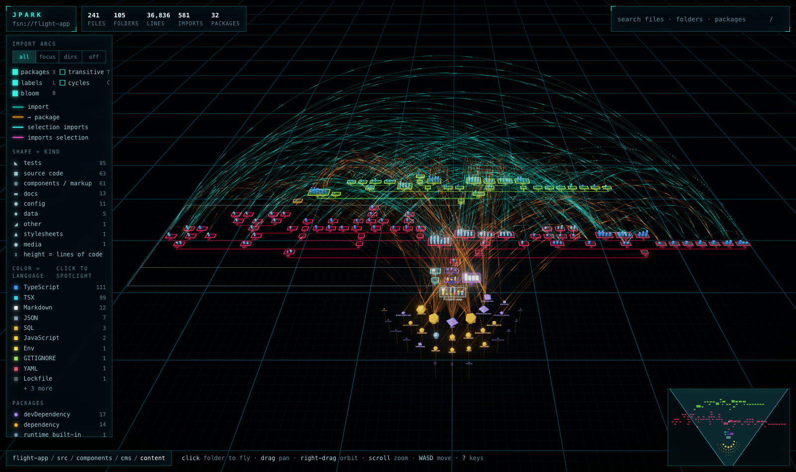
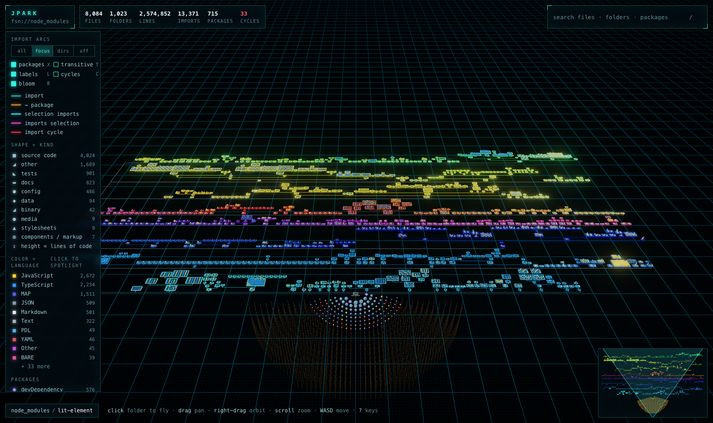

# jpark

> "It's a UNIX system! I know this!"

A 3D, fly-through map of any codebase, inspired by the SGI **fsn** file-system navigator from *Jurassic Park*.

- **Folders are pedestals** in a receding landscape; **files are blocks** standing on them.
- **Imports are ballistic arcs** — light pulses travel from the importer to the imported file.
- **External dependencies are satellites** floating off-shore, colored by how they are declared.
- **Shape = what a file is. Color = its language. Height = lines of code.**



## Use it

No install, no config — run it inside any project:

```sh
npx jpark
```

That scans the directory, starts a local viewer with live reload, and opens your browser.

```sh
npx jpark path/to/project        # scan somewhere else
npx jpark export -o map.html     # one self-contained HTML file: share it, attach it to CI
npx jpark json -o graph.json     # the raw dependency graph
```

Or add it to a project:

```sh
npm i -D jpark
```
```json
{ "scripts": { "map": "jpark", "map:export": "jpark export -o docs/codebase.html" } }
```

jpark has **zero runtime dependencies** (three.js is pre-bundled into the viewer), so installing it adds exactly one package.

### Options

| flag | |
|---|---|
| `-o, --out <file>` | output path for `export` / `json` |
| `-p, --port <n>` | viewer port (default 4747, next free one if taken) |
| `--host <addr>` | interface to bind (default 127.0.0.1) |
| `-i, --ignore <glob>` | extra ignore pattern, gitignore syntax — repeatable |
| `-a, --alias <from=to>` | import alias, e.g. `-a @=src` — repeatable |
| `--max-files <n>` | stop scanning after n files (default 25000) |
| `--no-git` | walk the disk instead of asking git which files matter |
| `--no-unused` | hide manifest dependencies that nothing imports |
| `--no-open`, `--no-watch` | don't open the browser / don't re-scan on changes |

Optional config — `.jparkrc.json`, or a `"jpark"` key in `package.json`:

```json
{ "ignore": ["fixtures/", "*.snap"], "alias": { "@": "src" } }
```

## Flying

| | |
|---|---|
| **click** a folder | fly there · click a file or package to inspect it |
| **double-click** | fly to anything |
| **drag** / **right-drag** / **scroll** | pan / orbit / zoom to cursor |
| `W A S D`, `Q E`, `R F` | move (shift = fast), rotate, closer / further |
| `← →` `↑ ↓` | sibling folder · into child / up to parent |
| `space` · `H` | fly to selection · overview |
| `/` or `⌘K` | search files, folders and packages |
| `1 2 3 4` | arcs: **all** / **focus** (selection only) / **dirs** (bundled folder → folder) / **off** |
| `T` | follow imports transitively — "what breaks if I touch this?" |
| `C` | show only import cycles |
| `X` `L` `B` | toggle packages, labels, bloom |
| `?` | all keys |

Select something and its arcs light up: **cyan** = what it imports, **magenta** = what imports it, **amber** = packages, **red** = import cycles. Dashed arcs are type-only imports, dotted ones are dynamic `import()`. Select a folder to see everything that crosses its boundary. Click a language in the legend to spotlight it. The minimap is draggable.

## What it understands

| | imports resolved |
|---|---|
| **JavaScript / TypeScript** | ESM, CommonJS, dynamic `import()`, `export … from`, type-only imports, `new URL(…, import.meta.url)`; `tsconfig`/`jsconfig` `paths` + `baseUrl` (through `extends`, with comments); workspaces / monorepo packages (mapped back from `dist/` to source); package.json `exports` and `#imports`; `.js`→`.ts` specifiers; index files; React Native platform files; common bundler aliases (`@/`, `~/`, `$lib/`) |
| **Vue / Svelte / Astro / MDX** | `<script>` and `<style>` blocks, frontmatter |
| **CSS / SCSS / Sass / Less** | `@import`, `@use`, `@forward`, partials, `url()` assets, CSS-modules `composes` |
| **HTML** | scripts, stylesheets, media, inline module scripts |
| **Python** | absolute + relative imports, packages, `from x import module`; `pyproject.toml`, `requirements*.txt`, `Pipfile`, `setup.py/cfg` |
| **Go** | module-local packages (arcs land on the *folder*), stdlib, `go.mod` requires |
| **Rust** | `mod`, `use crate::/super::/self::`, workspace crates, `Cargo.toml` deps incl. fully-qualified paths |
| **C / C++ / Obj-C**, **Java / Kotlin / Scala**, **Ruby** | includes, package imports, `require` / `require_relative` + `Gemfile` |

Every other file still shows up in the landscape — it just has no arcs.

External packages are classified against the nearest manifest: **dependency**, **devDependency**, **peer/optional**, **runtime built-in**, or — in red — **imported but not declared anywhere**. Declared-but-never-imported packages appear dimmed.

File discovery uses `git ls-files` when available (so your `.gitignore` is honored exactly), and falls back to a disk walk that reads `.gitignore` files itself.

It is fast: ~8,000 files / 2.5M lines scan in about a second, and the viewer stays at full frame rate because every block, label and arc is GPU-instanced — all imports are a single draw call.



## API

```js
import { analyze, renderHtml, serve } from 'jpark';

const graph = await analyze('.', { ignore: ['fixtures/'], alias: { '@': 'src' } });

graph.stats;      // { files, dirs, lines, edges, externals, cycles, languages, … }
graph.cycles;     // [[fileId, fileId, …], …]  strongly connected components
graph.unresolved; // [{ from, spec }]  imports that point nowhere

await fs.writeFile('map.html', await renderHtml({ graph }));   // self-contained page
const server = await serve('.', { port: 4747 });               // live-reloading viewer
```

The graph is plain JSON (`nodes` are dirs, files and externals; `edges` are `{ from, to, kind, cycle? }` with ids indexing into `nodes`) — see [`src/types.ts`](src/types.ts). Handy for CI checks such as "fail on new import cycles".

## Development

```sh
npm install
npm run dev        # rebuild on change
npm test           # build + analyzer tests
npm run typecheck
node dist/cli.js ../some-project
```

`src/analyzer` is the Node-side scanner (one small module per language in `languages/` — adding one is ~50 lines), `src/viewer` is the three.js front end, `src/server.ts` and `src/html.ts` glue them together.

MIT
